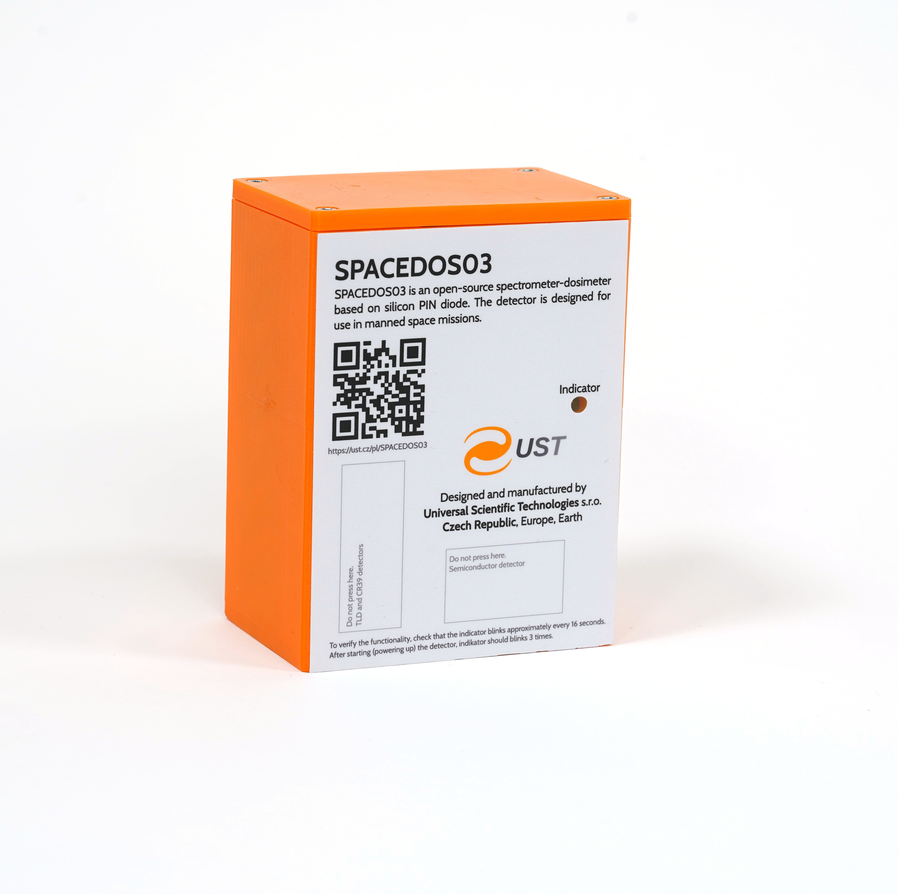

SPACEDOS03 is an open-source semiconductor particle detector (dosimeter and spectrometer) for space applications. The detector is based on a silicon PIN diode. The Detector is designed as autonomous for long-term measurement campaigns and therefore contains its own power source from high-capacity battery cells and a recording medium in the form of an industrial SD card. The device is designed to be able to work for half a year continuously.

The detector is mounted into a 3D-printed box that contains positions for passive TLDs and track detectors.

## Parameters

 * Silicon PIN diode detector with 44 mm³ detection volume
 * Effective number of energy channels 470 ±3
 * Deposited energy ranges from 60 keV to 7 MeV
 * Energy measurement resolution 15 ±2 keV (depending on calibration method and type of particles)
 * Power supply 18650 Li-ion cells
 * Integration time depends on firmware setup
 * Data storage device: Industrial SLC SDcard
 * Dimensions - 120 x 90 x 62 mm
 * Weight - 447 grams (with SAFT batteries)

The device is being used onboard ISS.
